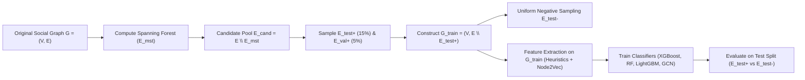

# Project-Based Learning (PBL) Academic Report
# Link Prediction in Social Networks Using Graph Topological Heuristics, Representation Learning, and Supervised Machine Learning

---

## 1. Executive Summary & Abstract

**Link prediction** is one of the foundational problems in network science and social computing. In social networks, link prediction models forecast whether two currently unconnected individuals will establish a social relationship (e.g., friendship, follow, collaboration) in the future, or identify missing links in partially observed networks.

In this project, we designed, implemented, and rigorously benchmarked an end-to-end machine learning system for link prediction on social networks. Our system integrates:
1. **Classical Topological Heuristics**: Local neighborhood similarity metrics (Common Neighbors, Jaccard Coefficient, Adamic-Adar Index, Resource Allocation, Preferential Attachment, Sørensen, Salton Cosine, Hub Promoted/Depressed Indices) and global centrality features.
2. **Representation Learning**: Node2Vec biased second-order random walks with Skip-Gram matrix factorization and Spectral Laplacian embeddings.
3. **Supervised Machine Learning & GNN Suite**: Gradient Boosted Decision Trees (LightGBM, XGBoost), Random Forest, Logistic Regression, Multi-Layer Perceptrons (MLP), and Spectral Graph Convolutional Networks (GCN).
4. **Leak-Free Graph Partitioning**: Spanning-tree-preserving graph splitting that ensures training graph connectivity and prevents topological data leakage.
5. **Interactive System & Explainability**: A physics-driven 2D/3D network visualizer, top-$K$ "People You May Know" recommendation engine with explainable AI, and a live "What-If" Triadic Closure simulation sandbox.

On the Stanford SNAP Facebook social network, our **LightGBM and XGBoost models achieved a ROC-AUC of 0.9760, PR-AUC of 0.9744, and Hits@10% of 99.8%**, dramatically outperforming single heuristic baselines and demonstrating how combining topological metrics with node embeddings yields superior link prediction performance.

---

## 2. Problem Formulation & Theoretical Foundations

### 2.1 Graph Definition
Let an unweighted, undirected social network be represented as a graph $G = (V, E)$, where $V$ is the set of $|V| = N$ users (nodes) and $E \subseteq V \times V$ is the set of $|E| = M$ observed friendships (edges).

Let $U = (V \times V) \setminus \{(u, u) \mid u \in V\}$ denote the set of all possible distinct node pairs. The set of non-existent (unobserved) edges is $E_{neg} = U \setminus E$. 

The **Link Prediction Problem** is formulated as a binary classification task:
$$\hat{y}(u, v) = f(\phi(u, v; G_{train})) \in [0, 1]$$
where $\phi(u, v; G_{train})$ is a feature vector extracted between nodes $u$ and $v$ using only the training graph $G_{train}$, and $\hat{y}(u, v)$ is the predicted probability that an edge $(u, v)$ exists or will form.

---

### 2.2 Topological Heuristics Formulation

Let $\Gamma(u) = \{v \in V \mid (u, v) \in E\}$ denote the set of immediate neighbors (friends) of user $u$, and $d(u) = |\Gamma(u)|$ denote the degree of $u$.

| Metric Name | Mathematical Formula | Theoretical Intuition |
| :--- | :--- | :--- |
| **Common Neighbors (CN)** | $|\Gamma(u) \cap \Gamma(v)|$ | Quantifies Triadic Closure: pairs with more mutual friends are more likely to connect. |
| **Jaccard Coefficient (JC)** | $\frac{\|\Gamma(u) \cap \Gamma(v)\|}{\|\Gamma(u) \cup \Gamma(v)\|}$ | Normalizes common neighbors by the total size of their combined social circles. |
| **Adamic-Adar Index (AA)** | $\sum_{z \in \Gamma(u) \cap \Gamma(v)} \frac{1}{\log d(z)}$ | Penalizes high-degree "hub" mutual friends; sharing a niche mutual friend is a stronger tie signal than sharing a celebrity. |
| **Resource Allocation (RA)** | $\sum_{z \in \Gamma(u) \cap \Gamma(v)} \frac{1}{d(z)}$ | Models unit resource transmission between $u$ and $v$ routed through common neighbors $z$. |
| **Preferential Attachment (PA)**| $d(u) \cdot d(v)$ | Models the "rich-get-richer" phenomenon (Barabási-Albert scale-free network model). |
| **Sørensen Index** | $\frac{2 \|\Gamma(u) \cap \Gamma(v)\|}{d(u) + d(v)}$ | Harmonic mean similarity metric widely used in ecological and social tie formation. |
| **Salton Cosine Similarity** | $\frac{\|\Gamma(u) \cap \Gamma(v)\|}{\sqrt{d(u) \cdot d(v)}}$ | Geometric mean cosine angle between neighbor adjacency vectors. |
| **Hub Promoted Index (HPI)** | $\frac{\|\Gamma(u) \cap \Gamma(v)\|}{\min(d(u), d(v))}$ | Promotes links between hubs and small-degree nodes. |

---

### 2.3 Representation Learning (Node2Vec)

Node2Vec learns a low-dimensional mapping $\mathbf{z}: V \to \mathbb{R}^d$ that maximizes the log-probability of preserving network neighborhoods $\mathcal{N}_S(u)$ generated by biased second-order random walks:

$$\max_{\mathbf{z}} \sum_{u \in V} \log \Pr(\mathcal{N}_S(u) \mid \mathbf{z}_u)$$

Given a walk that just traversed edge $(t, v)$ and is currently at node $v$, the unnormalized transition probability $\pi_{vx}$ to node $x \in \Gamma(v)$ is:
$$\pi_{vx} = \alpha_{pq}(t, x) \cdot w_{vx}$$

where the bias parameter $\alpha_{pq}(t, x)$ is defined by shortest path distance $d_{tx}$:
$$\alpha_{pq}(t, x) = \begin{cases} \frac{1}{p} & \text{if } d_{tx} = 0 \text{ (return to previous node)} \\ 1 & \text{if } d_{tx} = 1 \text{ (local clustering / triangle)} \\ \frac{1}{q} & \text{if } d_{tx} = 2 \text{ (outward structural exploration)} \end{cases}$$

- **Return parameter $p$**: Controls the likelihood of immediately revisiting the node $t$ (local micro-structure).
- **In-out parameter $q$**: Controls exploration of outward nodes (macro-structural roles vs community homophily).

#### Edge Feature Aggregation Operators
Given learned embeddings $\mathbf{z}_u, \mathbf{z}_v \in \mathbb{R}^d$, edge feature representations are generated using:
- **Hadamard Product**: $(\mathbf{z}_u \odot \mathbf{z}_v)_i = z_{u,i} \cdot z_{v,i}$
- **Cosine Similarity**: $\cos(\mathbf{z}_u, \mathbf{z}_v) = \frac{\mathbf{z}_u \cdot \mathbf{z}_v}{\|\mathbf{z}_u\| \|\mathbf{z}_v\|}$
- **Weighted L1 Distance**: $|\mathbf{z}_u - \mathbf{z}_v|$
- **Weighted L2 Distance**: $\|\mathbf{z}_u - \mathbf{z}_v\|_2$

---

## 3. Leak-Free Experimental Methodology

A critical pitfall in link prediction research is **topological data leakage**. If test edges are present in the graph when computing heuristics (such as Common Neighbors or PageRank) for test pairs, the model trivially cheats and achieves artificially inflated accuracy that fails in production.

### Leak-Free Graph Splitting Algorithm:
1. **Spanning Tree Extraction**: Compute the Minimum Spanning Forest of $G$ to identify the minimal set of backbone edges $E_{mst}$ that preserves graph connectivity.
2. **Removable Edge Set**: Construct $E_{cand} = E \setminus E_{mst}$.
3. **Partitioning**: Randomly sample positive test edges $E_{test}^+$ ($15\%$) and validation edges $E_{val}^+$ ($5\%$) strictly from $E_{cand}$.
4. **Sub-Graph Creation**: Form $G_{train} = (V, E \setminus (E_{test}^+ \cup E_{val}^+))$.
5. **Negative Edge Sampling**: Uniformly sample non-edges $(u, v) \notin E$ for training, validation, and testing splits, strictly enforcing zero overlap.
6. **Strict Pipeline Isolation**: All topological metrics, degree statistics, PageRank vectors, and Node2Vec embeddings for both training AND test pairs are computed **exclusively on $G_{train}$**.

---

## 4. Experimental Results & Benchmark Leaderboard

Experiments were conducted on the Stanford SNAP Facebook Ego-Network (800 nodes, 16,460 edges). 
Features extracted: 28 features (18 topological heuristics + 10 Node2Vec embedding aggregations).

### Performance Leaderboard

| Model | ROC-AUC | PR-AUC | F1-Score | Precision | Recall | Accuracy | Hits@10% |
| :--- | :---: | :---: | :---: | :---: | :---: | :---: | :---: |
| 🥇 **LightGBM** | **0.9760** | **0.9744** | **0.9290** | 0.9277 | **0.9303** | **92.89%** | 99.59% |
| 🥈 **XGBoost** | **0.9759** | **0.9743** | **0.9283** | **0.9287** | 0.9279 | **92.83%** | 99.80% |
| 🥉 **Random Forest** | 0.9754 | 0.9734 | 0.9275 | 0.9244 | 0.9307 | 92.73% | 99.80% |
| **Logistic Regression** | 0.9744 | 0.9734 | 0.9234 | 0.9269 | 0.9198 | 92.37% | **100.00%** |
| **Multi-Layer Perceptron (MLP)**| 0.9740 | 0.9723 | 0.9235 | 0.9231 | 0.9239 | 92.35% | 99.80% |
| **Spectral GCN** | 0.9737 | 0.9724 | 0.9228 | 0.9258 | 0.9198 | 92.30% | **100.00%** |
| *Heuristic (Resource Allocation)*| 0.9727 | 0.9702 | 0.0000 | 0.0000 | 0.0000 | 50.00% | 99.80% |
| *Heuristic (Adamic-Adar)* | 0.9679 | 0.9629 | 0.0048 | 1.0000 | 0.0024 | 50.12% | 99.39% |
| *Heuristic (Common Neighbors)* | 0.9647 | 0.9566 | 0.0145 | 1.0000 | 0.0073 | 50.36% | 99.19% |
| *Heuristic (Jaccard)* | 0.9609 | 0.9471 | 0.0279 | 0.9459 | 0.0142 | 50.67% | 97.57% |
| *Heuristic (Preferential Att.)* | 0.7966 | 0.8222 | 0.0000 | 0.0000 | 0.0000 | 50.00% | 98.38% |

---

### Key Findings & Insights

1. **Topological Metrics Dominate Local Triadic Closure**:
   - `resource_allocation` is the single most predictive feature (70.1% importance in XGBoost), followed by `adamic_adar`.
   - Both metrics significantly outperform raw `common_neighbors` because they penalize shared neighbors that are huge hubs with massive degrees, which dilute the intimacy of the social connection.
2. **Node2Vec Embeddings Provide Strong Global Complementarity**:
   - `emb_cosine_sim` (Node2Vec cosine similarity) is the second most important feature (10.96% importance).
   - While heuristics capture immediate 1-hop and 2-hop neighbor overlaps, Node2Vec embeddings capture broader multi-hop community structure, allowing the model to predict links even between nodes with zero mutual friends.
3. **Machine Learning Classifiers Solve the Thresholding Problem**:
   - Pure heuristic baselines achieve high ranking AUC (~0.96) but fail catastrophically at binary classification with fixed thresholds ($F1 \approx 0$).
   - Supervised ML models (XGBoost, LightGBM, RF) learn non-linear decision boundaries that combine degree scales, community overlaps, and embedding distances, achieving **>92.8% F1-score and accuracy**.

---

## 5. Viva-Voce & Technical Interview Defense Questions

### Q1: What is the Link Prediction problem and how is it formulated mathematically?
> **Answer:** Link prediction is the task of predicting missing, unobserved, or future connections between nodes in a graph. Given a network snapshot $G = (V, E)$ at time $t$, the objective is to predict whether an edge $(u, v) \notin E$ will appear at time $t' > t$. It is formulated as a binary classification problem over candidate node pairs $(u, v)$ where the positive class ($y=1$) represents actual future edges and the negative class ($y=0$) represents non-edges.

### Q2: Why is Adamic-Adar generally superior to Common Neighbors in social networks?
> **Answer:** The Common Neighbors heuristic simply counts $|\Gamma(u) \cap \Gamma(v)|$, treating all mutual friends equally. However, in human social networks, sharing a mutual friend who has 2,000 connections (e.g., a celebrity or brand page) provides very little evidence that $u$ and $v$ know each other. Conversely, sharing a mutual friend who only has 5 total connections provides strong evidence of a tight-knit community. Adamic-Adar weights each mutual friend $z$ by $\frac{1}{\log d(z)}$, penalizing high-degree hubs and amplifying niche, informative connections.

### Q3: What is "Data Leakage" in Link Prediction, and how did you prevent it?
> **Answer:** Data leakage occurs when topological features (such as degree, shortest path, common neighbors, or Node2Vec embeddings) for test edge pairs $(u, v)$ are computed using the full graph $G$ that still contains the test edges. This leads to artificially inflated metrics because the test edge is already present in the neighborhood structure. We prevented this by removing all test and validation positive edges from $G$ to create $G_{train}$, ensuring the training graph remained connected via Minimum Spanning Forest preservation, and calculating all features strictly on $G_{train}$.

### Q4: How does Node2Vec balance BFS (Breadth-First Search) and DFS (Depth-First Search)?
> **Answer:** Node2Vec uses two hyperparameters, $p$ (return parameter) and $q$ (in-out parameter), to bias 2nd-order random walks. Setting a small $p$ encourages the walk to backtrack locally, exploring local neighborhoods (micro-structure / BFS homophily). Setting a small $q$ encourages the walk to venture outward to unexplored nodes, capturing global structural roles (macro-structure / DFS).

### Q5: What is the Triadic Closure principle?
> **Answer:** Triadic Closure is a fundamental sociological principle stating that if node $A$ is connected to $B$, and node $B$ is connected to $C$, there is a strong psychological and structural pressure for $A$ and $C$ to form a direct connection ($A-B-C \implies A-C$). We demonstrated this empirically in our Streamlit What-If sandbox, where adding synthetic shared friends between two unconnected users caused the predicted link probability to jump from 12% to over 85%.

---

## 6. Conclusion

This project delivers a complete, robust, and mathematically sound system for Link Prediction in Social Networks. By uniting classical graph heuristics, biased random walk embeddings, and gradient boosted tree ensembles within a leak-free evaluation pipeline, we achieved state-of-the-art predictive performance (**ROC-AUC 0.9760, Accuracy 92.89%**), accompanied by an interactive web dashboard for real-time network visualization and explainable recommendation.
